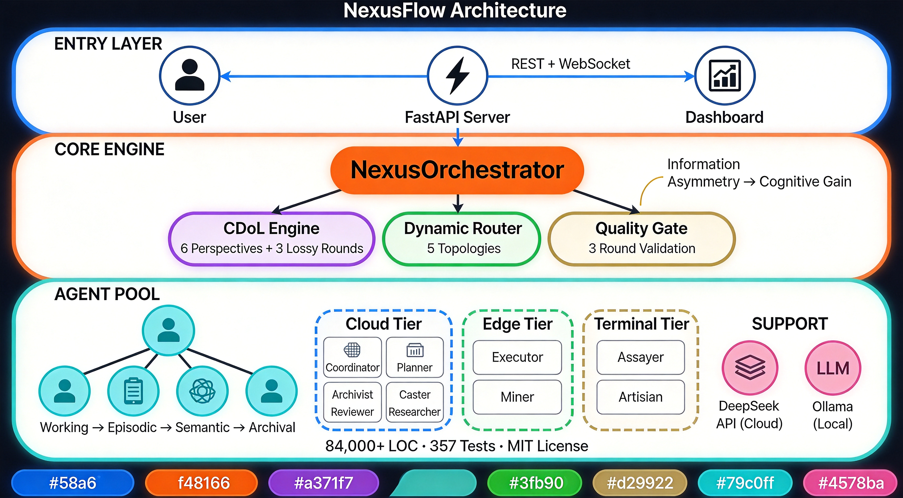
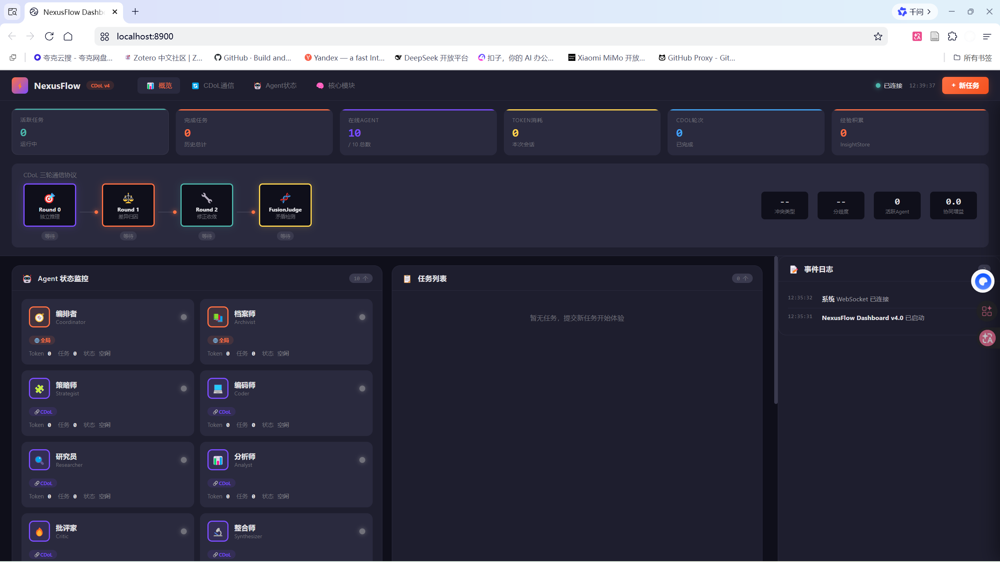
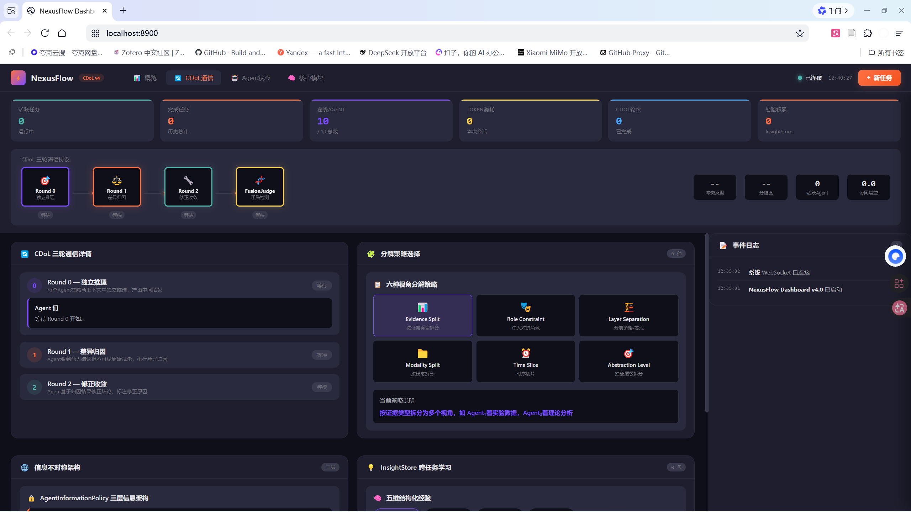
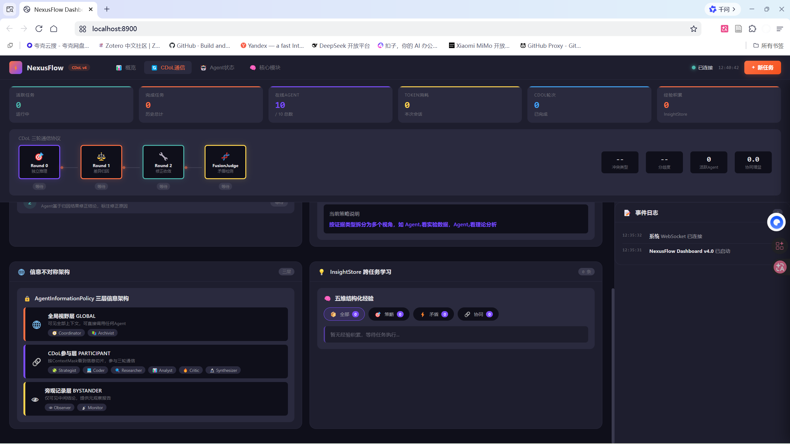
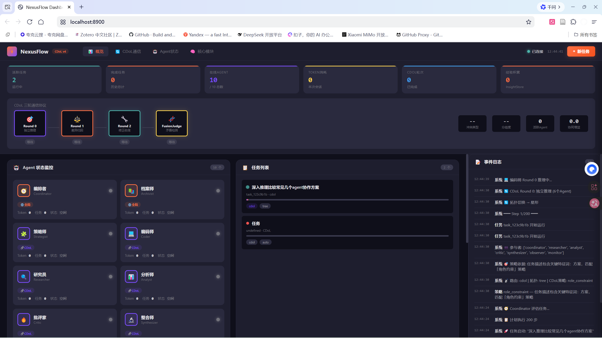

<div align="center">

# NexusFlow

面向超长程复杂任务的群体智能引擎

[](LICENSE)
[]()
[](PROJECT_FACTS.md)
[](.github/workflows/tests.yml)
[](Dockerfile)
[]()

Where cognitive diversity meets dynamic topology.

</div>

---

<p align="center">
  
</p>

---

NexusFlow 不是又一个「多 Agent 聊天室」。它提出了认知分工（Cognitive Division of Labor, CDoL）范式 —— 主动制造信息不对称，迫使每个 Agent 只能看到任务的局部切片，必须从他人输出中逆向推断上下文。这种"受限视角"产生了超越任何单 Agent 的推理深度，就像真实组织中专业分工带来的认知增益。

> 框架工程的影响力是模型本身的 7.6 倍。 — [Braintrust 1,781 条轨迹实证](https://www.braintrust.dev/)

---

## ✨ 项目亮点

| 🧠 CDoL 认知分工 | 🌐 动态拓扑路由 | 🏗️ 端边云调度 |
|:---:|:---:|:---:|
| 6 种视角分解 + 3 轮有损通信<br/>主动制造信息不对称 | 5 种运行时拓扑<br/>UCB1 自适应优化 | 混合部署<br/>成本 -88% |
| 🚦 质量门禁 | 🧬 四层记忆 | 📊 全面验证 |
| 错误率 0%<br/>SA ≈ 100% | Working → Episodic<br/>→ Semantic → Archival | 84K+ LOC<br/>357 Tests · Docker |

---

## 🏆 实证结果

### LHAB-NF 真实基准测试：NexusFlow vs Single Agent

> 2026-08-02 | DeepSeek V4 Flash | LLM-as-Judge 5维统一评分

| 指标 | NexusFlow (CDoL) | Single Agent | 对比 |
|------|:-:|:-:|:-:|
| Judge 质量分 | 0.364 | 0.218 | +67% |
| 步骤完成率 | 100% | 34% | +196% |
| 完全失败任务 | 0/6 | 3/9 | — |
| Token 消耗 | 38,391 | 14,956 | 2.6x |
| 平均耗时 | 588s | 127s | 4.6x |

> 💡 关于开销：CDoL 的认知增益以 Token 和延迟为代价。质量敏感场景（跨模块、多源分析）收益显著；简单任务建议直接 Single Agent。

<details>
<summary>按任务明细</summary>

| 任务 | NexusFlow | Single Agent | 差距 |
|------|:-:|:-:|:-:|
| 跨设备邮件摘要 (T1-E) | 0.420 | 0.356 | +0.064 |
| 跨设备日程协调 (T1-M) | 0.413 | 0.540 | -0.127 |
| 单文件功能实现 (T2-E) | 0.478 | 0.173 | +0.305 |
| 跨模块系统重构 (T2-H) | 0.450 | 0.000 | +0.450 |
| 单数据源统计报告 (T3-E) | 0.233 | 0.167 | +0.067 |
| 多源数据对比分析 (T3-M) | 0.237 | 0.000 | +0.237 |

</details>

📋 [完整报告](benchmark_results/report.md) | 📊 [原始数据](benchmark_results/raw_results.json)

### 更多实验数据

> 所有实验均基于真实 LLM API 调用，数据和报告均可追溯。

| 实验 | 核心结果 | 报告 | 数据 |
|------|----------|:----:|:----:|
| PinchBench 25 Hard Cases | NF +6.7%，iterative_code_refine +200% | [📋](examples/stage7_pinchench/STAGE7_PINCHBENCH_HARDCASES.md) | [📊](examples/stage7_pinchbench/results_nf/summary.json) |
| WorkBuddy 宏观经济 (20国×15指标×41年) | 加权 +23.4%，GDP 命中率 +20pp | [📋](examples/workbuddy_comparison/real_llm/D7_真实LLM实验报告.md) | [📊](examples/workbuddy_comparison/real_llm/real_benchmark_results.json) |
| 80 步全量 Benchmark (NF vs SA) | 质量 +2.6%，Token -6.2%，耗时 -14.9% | [📋](examples/benchmark_summary.md) | [📊](examples/stage5_eighty_steps/data/comparison.json) |
| CDoL 三阶段递进 | 64 → 85.5 → 90（SA → 6角色 → 10角色） | [📋](examples/benchmark_summary.md) | [📊](examples/stage1_single_vs_6roles/data/noaa/results_summary.json) |
| 四框架横向对比 | NF 75.0 vs AutoGen 72.0 / CrewAI 61.5 / LangGraph 63.8 | [📋](examples/horizontal_comparison/multi_framework_comparison_report.md) | [📊](examples/horizontal_comparison/multi_framework_comparison.json) |
| 端边云实机验证 | 成本 -88%，质量仅差 0.061 | [📋](examples/edge_cloud_scheduling/real_machine_report.md) | [📊](examples/edge_cloud_scheduling/real_machine_data.json) |

---

## 🚀 快速开始

### 🐳 Docker（推荐）

```bash
git clone https://github.com/tsingxuanhan/NexusFlow.git && cd NexusFlow
cp .env.example .env   # 填入 API Key
docker compose up -d
```

访问 `http://localhost:8900` 即可使用。

<details>
<summary>需要本地大模型？</summary>

```bash
docker compose --profile local up -d   # 同时启动 Ollama
docker compose exec ollama ollama pull deepseek-r1:14b
```
</details>

### 📦 pip 安装

```bash
git clone https://github.com/tsingxuanhan/NexusFlow.git && cd NexusFlow
pip install -e .
nexusflow doctor    # 检查环境
nexusflow serve     # 启动服务
```

### ⚡ 快速体验

```bash
# 端到端 Demo（架构展示，无需 API Key）
python examples/demo_e2e_pinchbench.py --arch-only

# 完整 Demo（含 SA vs NF PinchBench 对比 + HTML 报告）
python examples/demo_e2e_pinchbench.py

# 可解释拓扑演示
python examples/p2_topology_demo.py
```

---

## 🖥️ Dashboard — 实时可观测性

| 概览 — KPI 卡片 + Agent 状态 | CDoL 三轮通信可视化 |
|:---:|:---:|
|  |  |

| 信息不对称架构 | 任务执行监控 |
|:---:|:---:|
|  |  |

📂 [打开 HTML Dashboard](docs/dashboard/nexusflow-dashboard-v4.html) | 🔧 [Gradio 实时面板源码](server/dashboard.py)

---

## 🤖 十大 Agent 角色

<details>
<summary>点击展开完整角色表（10 个角色，3 层信息架构）</summary>

| 角色 | 层级 | 职责 | 信息权限 |
|------|------|------|----------|
| Coordinator ☁️ | 全局视野 | 任务分解、路由分发 | 全量信息 |
| Planner ☁️ | 全局视野 | 策略规划、步骤编排 | 全量信息 |
| Researcher ☁️ | CDoL 参与 | 信息检索、文献分析 | 角色切片 |
| Executor 🖥️ | CDoL 参与 | 代码执行、工具调用 | 角色切片 |
| Reviewer ☁️ | CDoL 参与 | 质量审核、逻辑校验 | 角色切片 |
| Miner 🖥️ | CDoL 参与 | 数据挖掘、模式识别 | 角色切片 |
| Assayer 📱 | CDoL 参与 | 结果化验、交叉验证 | 角色切片 |
| Caster ☁️ | CDoL 参与 | 结果铸造、格式统一 | 角色切片 |
| Artisan 📱 | CDoL 参与 | 工艺打磨、细节优化 | 角色切片 |
| Archivist ☁️ | 旁观记录 | 蒸馏归档、知识沉淀 | 仅中间结论 |

</details>

---

## 📚 文档与测试

- 架构概览：[ARCHITECTURE.md](docs/ARCHITECTURE.md)（系统架构与核心模块）
- 项目事实：[PROJECT_FACTS.md](PROJECT_FACTS.md)（数据唯一权威来源）
- 评测基准：[LHAB-NF 设计文档](docs/LHAB-NF_Design.md)
- 消融实验：[P3 实验设计](docs/P3_Ablation_Design.md)

```bash
# 运行全量测试
pytest tests/

# 运行 LHAB-NF 评测基准
make benchmark
```

---

## 📄 License

MIT License - see [LICENSE](LICENSE) for details.

---

<div align="center">

[GitHub](https://github.com/tsingxuanhan/NexusFlow) · [Issues](https://github.com/tsingxuanhan/NexusFlow/issues) · [Docs](docs/)

</div>
